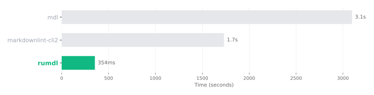

# Markdown linter benchmark

<!-- BENCHMARK_SUMMARY_START -->

In the February 2026 Rust Book cold-start benchmark, rumdl checked 478 Markdown files in 217
ms. The same run measured markdownlint-cli2 at 2.2 s and markdownlint-cli at 2.7 s.
These results support a specific claim: rumdl was about 10.2–12.5 times faster than the
tested markdownlint CLIs in this workload. They do not establish that rumdl is faster
than every Markdown tool.

<!-- BENCHMARK_SUMMARY_END -->

> **Last benchmark run: February 2026.** The page and methodology were last
> reviewed in August 2026.

## Results

<!-- BENCHMARK_TABLE_START -->

<p class="rm-table-hint" aria-hidden="true">Swipe horizontally to compare all columns.</p>
<div class="rm-table-scroll" role="region" aria-label="Markdown tool benchmark results" tabindex="0" markdown>

| Tool                  | Type   | Mean   | Relative to rumdl |
| --------------------- | ------ | ------ | ----------------- |
| **mado**              | Lint   | 77 ms  | 0.4x              |
| **rumdl**             | Lint   | 217 ms | 1.0x              |
| **pymarkdown**        | Lint   | 240 ms | 1.1x              |
| **remark-lint**       | Lint   | 671 ms | 3.1x              |
| **markdownlint-cli2** | Lint   | 2.2 s  | 10.2x             |
| **markdownlint-cli**  | Lint   | 2.7 s  | 12.5x             |
| **mdformat**          | Format | 4.0 s  | 18.5x             |
| **Prettier**          | Format | 4.8 s  | 22.3x             |

</div>

<!-- BENCHMARK_TABLE_END -->



## What the benchmark measures

The benchmark measures process startup plus one complete check of the Rust Book
repository:

- **Corpus:** The Rust Book snapshot used for the run; its file count appears in
  the generated summary above
- **Application cache:** disabled for rumdl with `--no-cache`
- **Operating-system disk cache:** warm after the configured warm-up runs
- **Runner:** [hyperfine](https://github.com/sharkdp/hyperfine/), with `sync`
  before each timed command
- **Failures:** ignored by the runner because lint violations produce a normal
  non-zero exit code

This is a cold-start workflow benchmark, not a parser microbenchmark. It includes
runtime and launcher overhead because developers and CI systems experience that
overhead when invoking the tools.

## Commands

The benchmark script executes these command shapes against the same target:

| Tool              | Command                                                          |
| ----------------- | ---------------------------------------------------------------- |
| rumdl             | `rumdl check --no-cache TARGET`                                  |
| markdownlint-cli  | `npx markdownlint-cli TARGET`                                    |
| markdownlint-cli2 | `npx markdownlint-cli2 '**/*.md'` from `TARGET`                  |
| remark-lint       | `npx remark --use remark-preset-lint-recommended --quiet TARGET` |
| pymarkdown        | `uvx pymarkdownlnt scan TARGET`                                  |
| mado              | `mado check TARGET`                                              |
| mdformat          | `uvx mdformat --check TARGET`                                    |
| Prettier          | `npx prettier --check 'TARGET/**/*.md'`                          |

The executable source of truth is
[`scripts/benchmark_cold_start.py`](https://github.com/rvben/rumdl/blob/main/scripts/benchmark_cold_start.py).

## Reproduce the benchmark

Install Rust, Python, Node.js, `uv`, and
[hyperfine](https://github.com/sharkdp/hyperfine/), then place a checkout of the
Rust Book next to the rumdl repository:

```bash
cargo build --release
python3 scripts/benchmark_cold_start.py --target ../rust-book
uv run --with matplotlib python3 scripts/generate_benchmark_chart.py
```

The first command builds the rumdl binary being tested. The benchmark script
writes hyperfine results locally, and the chart script updates this page's
generated result table and the public SVG chart.

## How to interpret the result

The most useful comparison is with markdownlint-cli and markdownlint-cli2:
rumdl implements all 53 markdownlint rules and can discover common markdownlint
configuration files, so the tools address a closely related job. Even then,
behavior is not identical; review the documented
[intentional differences](markdownlint-comparison.md#known-behavioral-differences)
before migrating.

mado was faster in this run, but it implemented fewer rules and did not generate
fixes or provide rumdl's flavor-aware behavior. Formatters such as mdformat and
Prettier also perform a different amount and type of work. The table is therefore
evidence about observed command latency, not a universal product ranking.

## Limitations

- Tool capabilities and workloads are not identical.
- One repository cannot represent every Markdown corpus.
- Results depend on hardware, operating system, tool versions, and repository
  contents.
<!-- BENCHMARK_METADATA_LIMITATION_START -->

- This published result predates benchmark metadata capture, so its exact tool versions
  and target revision were not retained. Treat it as directional until the next
  metadata-bearing run.

<!-- BENCHMARK_METADATA_LIMITATION_END -->

- `npx` and `uvx` launcher behavior can change independently of the tools.

The benchmark runner now records non-personal environment, target revision, and
tool-version metadata with future local results.

## Related comparisons

- [rumdl vs markdownlint](markdownlint-comparison.md)
- [Comparison with other Markdown tools](comparison.md)
- [rumdl vs mdformat](mdformat-comparison.md)
