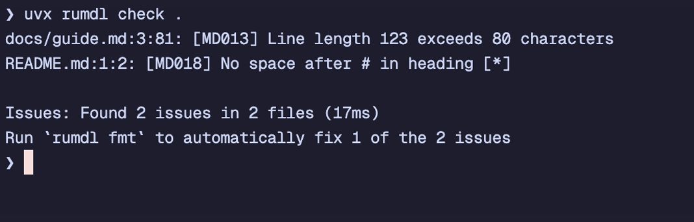

<!-- rumdl-disable MD041 -->

<nav class="rm-home-nav" aria-label="Primary site navigation">
<a class="rm-home-nav__docs" href="https://rumdl.dev/getting-started/quickstart/">Documentation</a>
<a href="https://rumdl.dev/playground/">Playground</a>
<a href="https://rumdl.dev/getting-started/installation/">Installation</a>
</nav>
<section class="rm-hero" aria-labelledby="rm-hero-title">

<h1 id="rm-hero-title">Clean Markdown. Fast.</h1>

Run a read-only check without a permanent install. Use rumdl defaults or keep your markdownlint configuration; one native binary finds, explains, and fixes Markdown across your terminal, editor, and CI.

Run a read-only check now

<code>uvx rumdl check .</code>
<button type="button" class="rm-copy" data-rm-copy="uvx rumdl check ." data-rm-command="uvx_check" aria-label="Copy read-only trial command">Copy command</button>

<a class="rm-button rm-button--secondary" href="https://rumdl.dev/getting-started/quickstart/" data-rm-event="cta_select" data-rm-action="repository_trial" data-rm-location="hero">60-second quickstart</a>
<a class="rm-button rm-button--secondary" href="https://rumdl.dev/markdownlint-comparison/" data-rm-event="cta_select" data-rm-action="compare_markdownlint" data-rm-location="hero">Compare with markdownlint</a>

The first run does not change files. rumdl works immediately and discovers common markdownlint configuration automatically.

<a href="https://rumdl.dev/playground/" data-rm-event="cta_select" data-rm-action="open_playground" data-rm-location="hero">Try in your browser</a>
<a href="https://rumdl.dev/getting-started/installation/" data-rm-event="cta_select" data-rm-action="install" data-rm-location="hero">Install rumdl</a>

<figure class="rm-terminal-shot">

<i></i><i></i><i></i>
<strong>rumdl — docs</strong>
zsh

<figcaption>Captured from an actual <code>uvx rumdl check .</code> run.</figcaption>
</figure>
</section>

<strong>One engine, every workflow.</strong> Run rumdl in the CLI, through its built-in language server, in CI, or as WebAssembly in the browser.

Trusted in public repositories including <strong>Firefox</strong>, <strong>Docker Docs</strong>, <strong>Apache Lucene</strong>, <strong>PyO3</strong>, and <strong>Rustlings</strong>. <a href="https://github.com/rvben/rumdl#used-by">See the adopter list</a>.

<section class="rm-section rm-workflow" aria-labelledby="rm-workflow-title">

<h2 id="rm-workflow-title">From warning to clean Markdown in one loop</h2>

Diagnostics stay precise and fixes stay close to the source, whether you are checking one file or an entire repository.

<ol class="rm-flow">
<li>
<code>rumdl check .</code>

<strong>Find the exact problem</strong>Rule, file, line, column, and a clear explanation.

</li>
<li>
<code>rumdl check --fix .</code>

<strong>Apply safe fixes</strong>Fix what can be automated and keep manual work explicit.

</li>
<li>
<code>rumdl fmt .</code>

<strong>Keep it consistent</strong>Format Markdown predictably across local and CI workflows.

</li>
</ol>
</section>
<section class="rm-section rm-performance" id="performance" aria-labelledby="rm-performance-title">

<h2 id="rm-performance-title">Fast enough to stay in the loop</h2>

Cold-start benchmark on the Rust Book repository: 478 Markdown files with application caches disabled.

<table>
<thead><tr><th scope="col">Linter</th><th scope="col">Mean time</th><th scope="col">Relative to rumdl</th></tr></thead>
<tbody>
<tr class="rm-benchmark__winner"><th scope="row">rumdl</th><td>217 ms</td><td>1.0×</td></tr>
<tr><th scope="row">markdownlint-cli2</th><td>2.2 s</td><td>10.2×</td></tr>
<tr><th scope="row">markdownlint-cli</th><td>2.7 s</td><td>12.5×</td></tr>
</tbody>
</table>

Repeated rumdl checks can also skip unchanged files. <a href="https://rumdl.dev/comparison/#performance">See the method and results</a>.

</section>
<section class="rm-section rm-capabilities" aria-labelledby="rm-capabilities-title">

<h2 id="rm-capabilities-title">Meet your Markdown where it lives</h2>

Keep one rule set across formats and tools without adding a runtime to every environment.

<strong><!-- RULE_COUNT -->82<!-- /RULE_COUNT --> lint rules</strong>Broad markdownlint compatibility with direct, configurable diagnostics.

<strong>Multiple Markdown flavors</strong>GFM, MkDocs, MDX, Quarto, MyST, and more.

<strong>Editor-native feedback</strong>A built-in language server with diagnostics, quick fixes, and formatting.

<strong>CI-ready output</strong>GitHub, GitLab, Azure, SARIF, JUnit, JSON, and other structured formats.

</section>
<nav class="rm-next" aria-label="Choose your next step">

<h2>Start with the shortest path</h2>

Check a repository without a permanent install, then change your workflow only if the results earn it.

<strong>Run the repository trial</strong>No install, no changed files, and your existing markdownlint configuration is discovered automatically.

<code>uvx rumdl check .</code>
<button type="button" class="rm-copy" data-rm-copy="uvx rumdl check ." data-rm-command="uvx_check" aria-label="Copy read-only trial command">Copy command</button>

<a class="rm-button rm-button--secondary" href="https://rumdl.dev/getting-started/quickstart/" data-rm-event="cta_select" data-rm-action="repository_trial" data-rm-location="next">Open the 60-second quickstart</a>

<a href="https://rumdl.dev/playground/" data-rm-event="cta_select" data-rm-action="open_playground" data-rm-location="next"><strong>Browser playground</strong>Try the same engine with no install</a>
<a href="https://rumdl.dev/markdownlint-comparison/" data-rm-event="cta_select" data-rm-action="compare_markdownlint" data-rm-location="next"><strong>Migrate from markdownlint</strong>Keep your configuration for the first run</a>

</nav>

